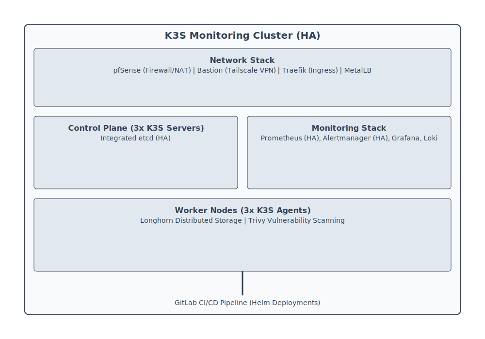

> **[Francais](#francais)** | **[English](#english)**

## Français

> **Projet d'équipe (3 membres)**

# Infrastructure de supervision K3S avec CI/CD

Cluster Kubernetes K3S complet (3 serveurs + 3 agents) exécutant une pile de supervision complète - Prometheus, Alertmanager, Grafana et Loki - déployé via Helm et géré par un pipeline CI/CD GitLab. L'infrastructure inclut MetalLB pour l'équilibrage de charge, Longhorn pour le stockage persistant, Traefik pour l'ingress, Trivy pour l'analyse de vulnérabilités et GLPI pour la gestion des actifs.

> **Cours :** Supervision
> **Équipe :** 3 membres
> **Ma contribution :** Construction à 100% de l'infrastructure - cluster K3S, tous les services de supervision, pipeline CI/CD, réseau, stockage, sécurité, pfSense, bastion. Les coéquipiers ont uniquement ajouté leurs propres exporteurs Prometheus et configurations d'alertes.

---

## Vue d'ensemble de l'architecture

### Réseau (192.168.0.0/24)

| Hôte | IP | Rôle |
|---|---|---|
| pfSense | 192.168.0.1 | Pare-feu, NAT, pont réseau |
| VM Bastion | 192.168.0.50 | Tunnel VPN Tailscale, proxy SSH inverse |
| Agent 1 | 192.168.0.101 | Nœud worker K3S |
| Agent 2 | 192.168.0.102 | Nœud worker K3S |
| Agent 3 | 192.168.0.103 | Nœud worker K3S |
| Traefik (x2) | 192.168.0.151 | Contrôleur d'ingress |
| Grafana | 192.168.0.153 | Tableaux de bord et visualisation |
| Loki | 192.168.0.154 | Agrégation des journaux |
| Prometheus (x2) | 192.168.0.155 | Collecte des métriques |
| Alertmanager (x2) | 192.168.0.156 | Routage et notifications des alertes |
| GLPI | 192.168.0.157 | Gestion des actifs informatiques |
| Serveur 1 | 192.168.0.201 | Serveur K3S (etcd + kubectl) |
| Serveur 2 | 192.168.0.202 | Serveur K3S (etcd + kubectl) |
| Serveur 3 | 192.168.0.203 | Serveur K3S (etcd + kubectl) |

---

## Architecture du cluster

**K3S** - Distribution Kubernetes allégée exécutant 3 nœuds serveurs avec etcd intégré pour la haute disponibilité et 3 nœuds agents pour les charges de travail.

**Réseau :**
- **Traefik** (x2) - Contrôleur d'ingress gérant le routage du trafic externe vers les services
- **MetalLB** - Équilibreur de charge bare-metal fournissant des IP externes pour les services
- **pfSense** - Pare-feu avec NAT et redirection de ports en bordure du réseau
- **VM Bastion** - Tunnel VPN Tailscale pour l'accès distant sécurisé

**Stockage :**
- **Longhorn** - Stockage bloc distribué fournissant des volumes persistants (PVC) sur les nœuds agents

**Sécurité :**
- **Trivy** - Analyse de vulnérabilités des images de conteneurs

---

## Pile de supervision

**Prometheus** (x2) - Collecte les métriques de tous les nœuds, services et exporteurs personnalisés. Déploiement HA pour la redondance.

**Alertmanager** (x2) - Reçoit les alertes de Prometheus, gère la déduplication, le regroupement et le routage des notifications. Déploiement HA.

**Grafana** - Tableaux de bord pour visualiser les métriques Prometheus et les journaux Loki.

**Loki** - Agrégation et interrogation des journaux, intégré à Grafana.

**GLPI + Agent GLPI** - Suivi de l'inventaire des actifs informatiques sur les nœuds du cluster.

**Exporteur MariaDB** - Expose les métriques de la base de données à Prometheus.

---

## Pipeline CI/CD (GitLab)

La configuration de supervision est gérée comme du code dans GitLab. Les modifications des configurations Prometheus ou des exporteurs déclenchent un pipeline automatisé :

1. **Déclencheur** - Push vers `prometheus.yaml` ou `mysqlexporter.yaml`
2. **Validation** - Lint YAML pour détecter les erreurs de syntaxe
3. **Déploiement** - Installation Helm pour appliquer la configuration au cluster
4. **Mise à jour** - `helm upgrade` pour déployer les modifications sans interruption

---

## Tech stack

K3S, etcd, Prometheus, Alertmanager, Grafana, Loki, Traefik, MetalLB, Longhorn, Trivy, GLPI, MariaDB, Helm, GitLab CI/CD, pfSense, Tailscale

---

## English

> **Team project (3 members)**

# K3S Monitoring Infrastructure with CI/CD

Full K3S Kubernetes cluster (3 servers + 3 agents) running a complete monitoring stack - Prometheus, Alertmanager, Grafana, and Loki - deployed via Helm and managed through a GitLab CI/CD pipeline. Infrastructure includes MetalLB for load balancing, Longhorn for persistent storage, Traefik for ingress, Trivy for security scanning, and GLPI for asset management.

> **Course:** Supervision
> **Team:** 3 members
> **My scope:** Built 100% of the infrastructure - K3S cluster, all monitoring services, CI/CD pipeline, networking, storage, security, pfSense, bastion. Teammates only added their own Prometheus exporters and alert configurations.

---

## Architecture overview

### Network (192.168.0.0/24)

| Host | IP | Role |
|---|---|---|
| pfSense | 192.168.0.1 | Firewall, NAT, bridge |
| Bastion VM | 192.168.0.50 | Tailscale VPN tunnel, reverse SSH proxy |
| Agent 1 | 192.168.0.101 | K3S worker node |
| Agent 2 | 192.168.0.102 | K3S worker node |
| Agent 3 | 192.168.0.103 | K3S worker node |
| Traefik (x2) | 192.168.0.151 | Ingress controller |
| Grafana | 192.168.0.153 | Dashboards and visualization |
| Loki | 192.168.0.154 | Log aggregation |
| Prometheus (x2) | 192.168.0.155 | Metrics collection |
| Alertmanager (x2) | 192.168.0.156 | Alert routing and notifications |
| GLPI | 192.168.0.157 | IT asset management |
| Server 1 | 192.168.0.201 | K3S server (etcd + kubectl) |
| Server 2 | 192.168.0.202 | K3S server (etcd + kubectl) |
| Server 3 | 192.168.0.203 | K3S server (etcd + kubectl) |

---

## Cluster architecture

**K3S** - Lightweight Kubernetes distribution running 3 server nodes with embedded etcd for HA and 3 agent nodes for workloads.

**Networking:**
- **Traefik** (x2) - Ingress controller handling external traffic routing to services
- **MetalLB** - Bare-metal load balancer providing external IPs for services
- **pfSense** - Firewall with NAT and port redirection at the network edge
- **Bastion VM** - Tailscale VPN tunnel for secure remote access

**Storage:**
- **Longhorn** - Distributed block storage providing persistent volumes (PVCs) across agent nodes

**Security:**
- **Trivy** - Container image vulnerability scanning

---

## Monitoring stack

**Prometheus** (x2) - Scrapes metrics from all nodes, services, and custom exporters. HA deployment for redundancy.

**Alertmanager** (x2) - Receives alerts from Prometheus, handles deduplication, grouping, and notification routing. HA deployment.

**Grafana** - Dashboards for visualizing Prometheus metrics and Loki logs.

**Loki** - Log aggregation and querying, integrated with Grafana.

**GLPI + GLPI Agent** - IT asset inventory tracking across cluster nodes.

**MariaDB Exporter** - Exposes database metrics to Prometheus.

---

## CI/CD pipeline (GitLab)

The monitoring configuration is managed as code in GitLab. Changes to the Prometheus or exporter configs trigger an automated pipeline:

1. **Trigger** - Push to `prometheus.yaml` or `mysqlexporter.yaml`
2. **Validate** - YAML linting to catch syntax errors
3. **Deploy** - Helm install to apply the configuration to the cluster
4. **Upgrade** - `helm upgrade` to roll out changes with zero downtime

---

## Tech stack

K3S, etcd, Prometheus, Alertmanager, Grafana, Loki, Traefik, MetalLB, Longhorn, Trivy, GLPI, MariaDB, Helm, GitLab CI/CD, pfSense, Tailscale
