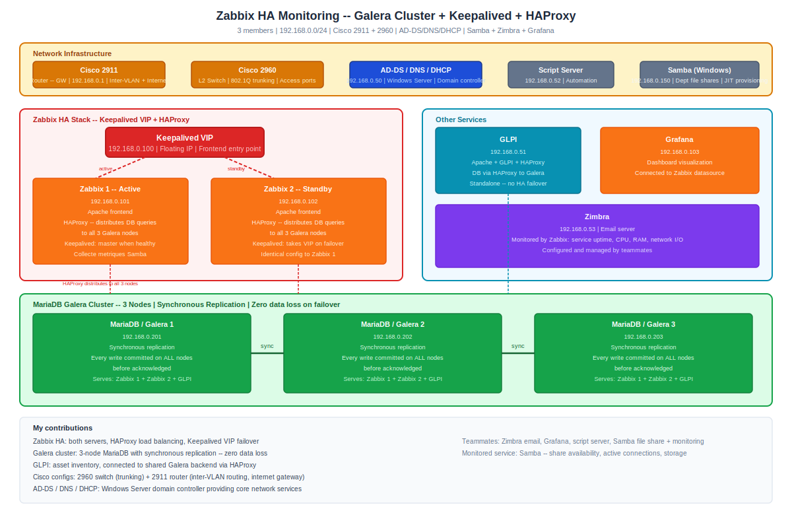

> **[Francais](#francais)** | **[English](#english)**

## Français

> **Projet d'équipe (3 membres)**

# Infrastructure de supervision Zabbix haute disponibilité

Déploiement Zabbix en haute disponibilité pour surveiller une infrastructure réseau multi-services. Deux serveurs Zabbix fonctionnent derrière HAProxy avec Keepalived gérant une VIP flottante, soutenu par un cluster MariaDB Galera à 3 nœuds avec réplication synchrone. GLPI fonctionne en standalone mais partage le même backend Galera via HAProxy pour sa base de données. Chaque membre de l'équipe a déployé un service réseau et configuré Zabbix pour collecter des métriques générales et spécifiques au service.

> **Cours :** Supervision
> **Équipe :** 3 membres
> **Ma contribution :** Zabbix HA (les deux serveurs, Keepalived, HAProxy), cluster Galera, GLPI, configurations switch/routeur Cisco, AD-DS/DNS/DHCP
> **Coéquipiers :** Zimbra, Grafana, serveur de scripts, service Samba + supervision

---

## Vue d'ensemble de l'architecture

### Réseau (192.168.0.0/24)

| Hôte | IP | Rôle |
|---|---|---|
| AD-DS / DNS / DHCP | 192.168.0.50 | Contrôleur de domaine, résolution de noms, attribution d'adresses |
| GLPI / Apache | 192.168.0.51 | Gestion des actifs informatiques (standalone, BD sur Galera) |
| Serveur de scripts | 192.168.0.52 | Scripts d'automatisation |
| Zimbra | 192.168.0.53 | Serveur de messagerie |
| VIP Keepalived | 192.168.0.100 | IP flottante pour le frontend Zabbix |
| Zabbix 1 / Apache / HAProxy | 192.168.0.101 | Serveur Zabbix + nœud HA |
| Zabbix 2 / Apache / HAProxy | 192.168.0.102 | Serveur Zabbix + nœud HA |
| Grafana | 192.168.0.103 | Visualisation des tableaux de bord |
| Samba (Windows) | 192.168.0.150 | Service de partage de fichiers et stockage |
| MariaDB / Galera 1 | 192.168.0.201 | Nœud de base de données |
| MariaDB / Galera 2 | 192.168.0.202 | Nœud de base de données |
| MariaDB / Galera 3 | 192.168.0.203 | Nœud de base de données |
| Cisco 2960 | - | Commutateur de couche 2 (trunk) |
| Cisco 2911 | 192.168.0.1 | Routeur / passerelle internet |

---

## Pile haute disponibilité

**Zabbix HA** - Deux serveurs Zabbix (192.168.0.101 et .102) fonctionnent de manière identique avec des frontends Apache. Keepalived gère une VIP flottante à 192.168.0.100 - si le nœud actif tombe, le nœud de secours prend le relais automatiquement.

**HAProxy** - Équilibre les connexions entrantes vers le frontend Zabbix et répartit les requêtes de base de données sur les nœuds Galera. Les deux serveurs Zabbix et GLPI se connectent à MariaDB via HAProxy.

**Cluster Galera** - Trois nœuds MariaDB avec réplication synchrone. Chaque écriture est validée sur les trois nœuds avant d'être acquittée, garantissant zéro perte de données en cas de basculement. Sert de backend de base de données partagé pour Zabbix et GLPI.

---

## Service surveillé : Samba (partage de fichiers)

Le service choisi par l'équipe était un serveur de fichiers Samba sous Windows (sans GPO). Il fournissait un stockage partagé basé sur les départements avec provisionnement automatique des répertoires utilisateurs - un script créait les répertoires personnels à la première connexion (similaire au provisionnement JIT). Les utilisateurs d'un même département pouvaient accéder aux fichiers partagés.

**La supervision comprenait :**
- Métriques générales : CPU, RAM, espace disque, E/S réseau, disponibilité du service
- Métriques spécifiques au service : disponibilité des partages Samba, connexions actives, consommation du stockage

---

## Mes contributions

- **Zabbix HA :** Configuration des deux serveurs Zabbix, équilibrage de charge HAProxy et basculement VIP Keepalived
- **Cluster Galera :** Déploiement et configuration du cluster MariaDB à 3 nœuds avec réplication synchrone
- **GLPI :** Mise en place de GLPI pour l'inventaire des actifs, connecté au backend Galera partagé
- **Configs Cisco :** Configuration du commutateur 2960 (trunking) et du routeur 2911 (routage inter-VLAN, passerelle internet)
- **AD-DS / DNS / DHCP :** Contrôleur de domaine Windows Server fournissant les services réseau de base

---

## Tech stack

Zabbix, MariaDB Galera, HAProxy, Keepalived, GLPI, Apache, Cisco IOS, Windows Server (AD-DS, DNS, DHCP), Samba, Grafana, Zimbra

---

## English

> **Team project (3 members)**

# Zabbix HA Monitoring Infrastructure

High-availability Zabbix deployment monitoring a multi-service network infrastructure. Two Zabbix servers run behind HAProxy with Keepalived managing a floating VIP, backed by a 3-node MariaDB Galera cluster using synchronous replication. GLPI runs standalone but shares the same Galera backend via HAProxy for its database. Each team member deployed a network service and configured Zabbix to collect both general and service-specific metrics.

> **Course:** Supervision
> **Team:** 3 members
> **My scope:** Zabbix HA (both servers, Keepalived, HAProxy), Galera cluster, GLPI, Cisco switch/router configs, AD-DS/DNS/DHCP
> **Teammates:** Zimbra, Grafana, script server, Samba service + monitoring

---

## Architecture overview

### Network (192.168.0.0/24)

| Host | IP | Role |
|---|---|---|
| AD-DS / DNS / DHCP | 192.168.0.50 | Domain controller, name resolution, address assignment |
| GLPI / Apache | 192.168.0.51 | IT asset management (standalone, DB on Galera) |
| Script server | 192.168.0.52 | Automation scripts |
| Zimbra | 192.168.0.53 | Email server |
| Keepalived VIP | 192.168.0.100 | Floating IP for Zabbix frontend |
| Zabbix 1 / Apache / HAProxy | 192.168.0.101 | Zabbix server + HA node |
| Zabbix 2 / Apache / HAProxy | 192.168.0.102 | Zabbix server + HA node |
| Grafana | 192.168.0.103 | Dashboard visualization |
| Samba (Windows) | 192.168.0.150 | File sharing and storage service |
| MariaDB / Galera 1 | 192.168.0.201 | Database node |
| MariaDB / Galera 2 | 192.168.0.202 | Database node |
| MariaDB / Galera 3 | 192.168.0.203 | Database node |
| Cisco 2960 | - | Layer 2 switch (trunk) |
| Cisco 2911 | 192.168.0.1 | Router / internet gateway |

---

## High availability stack

**Zabbix HA** - Two Zabbix servers (192.168.0.101 and .102) run identically with Apache frontends. Keepalived manages a floating VIP at 192.168.0.100 - if the active node goes down, the standby takes over automatically.

**HAProxy** - Load-balances incoming connections to the Zabbix frontend and distributes database queries across the Galera nodes. Both Zabbix servers and GLPI connect to MariaDB through HAProxy.

**Galera cluster** - Three MariaDB nodes with synchronous replication. Every write is committed across all three nodes before it's acknowledged, ensuring zero data loss on failover. Serves as the shared database backend for both Zabbix and GLPI.

---

## Monitored service: Samba (file sharing)

The team's chosen service was a Samba file server running on Windows (without GPO). It provided department-based shared storage with automatic user directory provisioning - a script created personal directories on first login (similar to JIT provisioning). Users within the same department could access shared files.

**Monitoring included:**
- General metrics: CPU, RAM, disk usage, network I/O, service uptime
- Service-specific metrics: Samba share availability, active connections, storage consumption

---

## My contributions

- **Zabbix HA:** Configured both Zabbix servers, HAProxy load balancing, and Keepalived VIP failover
- **Galera cluster:** Deployed and configured 3-node MariaDB cluster with synchronous replication
- **GLPI:** Set up GLPI for asset inventory, connected to the shared Galera backend
- **Cisco configs:** Configured the 2960 switch (trunking) and 2911 router (inter-VLAN routing, internet gateway)
- **AD-DS / DNS / DHCP:** Windows Server domain controller providing core network services

---

## Tech stack

Zabbix, MariaDB Galera, HAProxy, Keepalived, GLPI, Apache, Cisco IOS, Windows Server (AD-DS, DNS, DHCP), Samba, Grafana, Zimbra
