> **[Francais](#francais)** | **[English](#english)**

## Francais

> **Projet solo**

# Infrastructure PKI Microsoft à deux niveaux

Infrastructure PKI (Public Key Infrastructure) complète à deux niveaux, construite sur Windows Server 2022 avec AD CS et OpenSSL. Trois serveurs forment la chaîne de certificats : une AC racine hors ligne, une AC intermédiaire subordonnée, et un serveur web IIS avec HTTPS sécurisé par la chaîne de certificats signée. Inclut la distribution des CRL via HTTP.

> **Cours :** 420-H54-RO - Sécurité réseau
> **Projet solo** (TP1)

---

## Vue d'ensemble de l'architecture

### Serveurs

| Serveur | Nom d'hôte | IP | Rôle |
|---|---|---|---|
| AC racine | ROOT-JMR-A2025 | 192.168.2.183 | Autorité de certification racine hors ligne (AD CS) |
| AC intermédiaire | SUB-JMR-A2025 | 192.168.2.184 | CA subordonnée, signe les certificats d'entités finales (AD CS) |
| Serveur web | WEB-JMR-A2025 | 192.168.2.185 | IIS hébergeant le site HTTPS + point de distribution CRL |

Les trois serveurs fonctionnent sous Windows Server 2022 avec OpenSSL installé aux côtés d'AD CS.

---

## Chaîne de certificats

La chaîne de confiance complète : **AC racine - AC intermédiaire - Certificat du serveur web**

**AC racine** - Certificat racine auto-signé (RSA 4096, SHA-256, validité 20 ans). Installation d'AD CS en tant qu'autorité racine autonome, génération de la clé privée, auto-signature du certificat et publication de la CRL.

**AC intermédiaire** - Certificat subordonné signé par l'AC racine. Génération d'une CSR sur le serveur intermédiaire, soumission à la racine, signature et récupération. Import du certificat signé + CRL racine pour démarrer le service AD CS.

**Serveur web** - Certificat d'entité finale signé par l'AC intermédiaire (validité 1 an). Création d'un fichier de configuration SAN (requis par les navigateurs modernes comme Chrome), génération d'une CSR avec le SAN, signature par l'intermédiaire, puis création d'un fichier PFX pour IIS.

---

## Distribution des CRL

L'AC racine et l'AC intermédiaire publient leurs listes de révocation de certificats (CRL) dans un répertoire `CertEnroll` sur le serveur web IIS, accessible via HTTP. Les URL CDP sont configurées dans les extensions de chaque AC afin que les clients puissent vérifier la validité des certificats.

---

## Résumé du processus

1. Installer AD CS sur le serveur racine en tant qu'AC racine autonome
2. Configurer les URL du point de distribution CRL (CDP) pointant vers le serveur web
3. Générer la clé privée de l'AC racine (RSA 4096) et auto-signer le certificat racine
4. Publier la CRL racine
5. Installer AD CS sur le serveur intermédiaire en tant qu'AC subordonnée (le service ne démarrera pas encore - c'est normal)
6. Configurer les URL CDP intermédiaires
7. Générer la clé privée de l'AC intermédiaire et créer une CSR
8. Soumettre la CSR à l'AC racine, la signer, exporter le certificat
9. Importer le certificat intermédiaire signé + CRL racine dans le serveur intermédiaire pour démarrer AD CS
10. Publier la CRL intermédiaire
11. Distribuer les certificats racine et intermédiaires aux clients (magasins de certificats racines de confiance + AC intermédiaire)
12. Créer un fichier de configuration SAN pour le certificat du serveur web (DNS.1 + IP.1)
13. Générer la clé privée du serveur web et la CSR avec la configuration SAN
14. Soumettre la CSR à l'AC intermédiaire, la signer, exporter le certificat
15. Créer un bundle PFX (certificat web + clé privée + certificat intermédiaire)
16. Installer IIS, configurer le répertoire virtuel `CertEnroll`, ajouter les types MIME (.crt, .cer, .crl, .p7b)
17. Importer le PFX dans IIS et le lier au site par défaut sur le port 443 (HTTPS)
18. Mettre l'AC racine hors ligne - le serveur web reste fonctionnel tant que les certificats sont valides

---

## Concepts clés illustrés

- Hiérarchie PKI à deux niveaux avec AC racine hors ligne
- Cycle de vie des certificats : génération des clés, CSR, signature, distribution, révocation
- Distribution des CRL via HTTP (CertEnroll hébergé sur IIS)
- Configuration SAN pour la compatibilité avec les navigateurs modernes
- Empaquetage PFX pour la liaison HTTPS dans IIS
- Utilisation combinée d'AD CS (`certutil`) et d'OpenSSL
- AC racine mise hors ligne après la signature - bonne pratique de sécurité

---

## Tech stack

Windows Server 2022, AD CS (Certificate Services), OpenSSL, IIS, PKI/X.509, RSA 4096, SHA-256

---

## English

> **Solo project**

# 2-Tier Microsoft PKI Infrastructure

Full 2-tier Public Key Infrastructure built on Windows Server 2022 with AD CS and OpenSSL. Three servers form the certificate chain: an offline root CA, a subordinate intermediate CA, and a web server running IIS with HTTPS secured by the signed certificate chain. Includes CRL distribution via HTTP.

> **Course:** 420-H54-RO - Network Security
> **Solo project** (TP1)

---

## Architecture overview

### Servers

| Server | Hostname | IP | Role |
|---|---|---|---|
| Root CA | ROOT-JMR-A2025 | 192.168.2.183 | Offline root certificate authority (AD CS) |
| Intermediate CA | SUB-JMR-A2025 | 192.168.2.184 | Subordinate CA, signs end-entity certs (AD CS) |
| Web Server | WEB-JMR-A2025 | 192.168.2.185 | IIS hosting HTTPS site + CRL distribution point |

All three servers run Windows Server 2022 with OpenSSL installed alongside AD CS.

---

## Certificate chain

The full trust chain: **Root CA - Intermediate CA - Web Server Certificate**

**Root CA** - Self-signed root certificate (RSA 4096, SHA-256, 20-year validity). Installed AD CS as a standalone root authority, generated the private key, self-signed the certificate, and published the CRL.

**Intermediate CA** - Subordinate certificate signed by the Root CA. Generated a CSR on the intermediate server, submitted it to the root, had it signed and returned. Imported the signed cert + root CRL to bring the AD CS service online.

**Web Server** - End-entity certificate signed by the Intermediate CA (1-year validity). Created a SAN configuration file (required by modern browsers like Chrome), generated a CSR with the SAN, had it signed by the intermediate, then packaged everything into a PFX file for IIS.

---

## CRL distribution

Both the root and intermediate CAs publish their Certificate Revocation Lists to a `CertEnroll` directory on the IIS web server, accessible via HTTP. The CDP URLs are configured in each CA's extensions so clients can verify certificate validity.

---

## Process summary

1. Install AD CS on root server as standalone root CA
2. Configure CRL Distribution Point (CDP) URLs pointing to the web server
3. Generate root CA private key (RSA 4096) and self-sign the root certificate
4. Publish the root CRL
5. Install AD CS on intermediate server as subordinate CA (service won't start yet - expected)
6. Configure intermediate CDP URLs
7. Generate intermediate CA private key and create a CSR
8. Submit the CSR to the root CA, sign it, export the certificate
9. Import the signed intermediate cert + root CRL into the intermediate server to bring AD CS online
10. Publish the intermediate CRL
11. Distribute root and intermediate certificates to clients (trusted root + intermediate CA stores)
12. Create a SAN config file for the web server certificate (DNS.1 + IP.1)
13. Generate the web server private key and CSR using the SAN config
14. Submit the CSR to the intermediate CA, sign it, export the certificate
15. Create a PFX bundle (web cert + private key + intermediate cert)
16. Install IIS, configure the `CertEnroll` virtual directory, add MIME types (.crt, .cer, .crl, .p7b)
17. Import the PFX into IIS and bind it to the default site on port 443 (HTTPS)
18. Take the root CA offline - the web server remains functional as long as certs are valid

---

## Key concepts demonstrated

- 2-tier PKI hierarchy with offline root CA
- Certificate lifecycle: key generation, CSR, signing, distribution, revocation
- CRL distribution via HTTP (IIS-hosted CertEnroll)
- SAN configuration for modern browser compatibility
- PFX packaging for IIS HTTPS binding
- Mix of AD CS (`certutil`) and OpenSSL tooling
- Root CA taken offline after signing - security best practice

---

## Tech stack

Windows Server 2022, AD CS (Certificate Services), OpenSSL, IIS, PKI/X.509, RSA 4096, SHA-256
