> **[Francais](#francais)** | **[English](#english)**

## Francais

> **Projet d'équipe (2 membres)**

# Infrastructure de communications d'entreprise - Proxmox, FreePBX et Zimbra

Hyperviseur Proxmox bare-metal sur matériel physique hébergeant un environnement de communications d'entreprise avec messagerie Zimbra, VoIP FreePBX (avec téléphones physiques) et Windows Server fournissant AD DS, DNS et DHCP. Comprend un système IVR automatisé routant les appelants par département, intégration messagerie vocale vers email avec Zimbra, groupes de chasse et groupes de sonnerie sur 5 départements.

> **Cours :** Réseau / Communications
> **Équipe :** 2 membres
> **Ma contribution :** 100% de l'infrastructure - installation Proxmox, déploiement des VM (pilotes VirtIO pour Windows), toutes les configs réseau (routeur, commutateur L3, commutateur L2, VLANs, NAT, trunking), Windows Server (AD-DS, DNS, DHCP), installation Zimbra
> **Coéquipier :** Configuration IVR FreePBX, configuration des extensions, groupes de sonnerie/chasse

---

## Vue d'ensemble de l'architecture

---

## Infrastructure

### Hyperviseur

Proxmox VE installé bare-metal sur un PC physique de l'école. Tous les services fonctionnent en VM :

| VM | OS | Services |
|---|---|---|
| Windows Server | Windows Server 2019 (pilotes VirtIO) | AD-DS, DNS, DHCP |
| Zimbra | Rocky Linux 8 | Serveur de messagerie Zimbra 8 |
| FreePBX | SNG7-PBX | PBX VoIP avec IVR |

### Réseau

| Équipement | Nom d'hôte | Rôle |
|---|---|---|
| Routeur | RT-H33 | Passerelle NAT vers le réseau scolaire, routes statiques vers tous les VLANs |
| Commutateur L3 | SW3-H33 | Routage inter-VLAN, trunk vers Proxmox + SW2, liaison montante vers le routeur |
| Commutateur L2 | SW2-H33 | Ports d'accès clients/téléphones, LLDP, VLANs voix, trunk vers SW3 |

### VLANs

| VLAN | Nom | Sous-réseau | Objectif |
|---|---|---|---|
| 100 | SERV-COMM | 172.16.0.0/19 | Serveurs de communication (Zimbra, FreePBX) |
| 110 | SERV-ADMIN | 172.16.32.0/19 | Serveurs d'administration (AD-DS, DNS, DHCP) |
| 50 | CLIENTS-INT | 172.16.64.0/19 | Clients Proxmox internes |
| 10 | CLIENTS-EX-1 | 172.16.96.0/19 | Groupe de clients externes 1 |
| 20 | CLIENTS-EX-2 | 172.16.128.0/19 | Groupe de clients externes 2 |
| 11 | CLIENTS-EX-V-1 | 172.16.160.0/19 | VLAN voix groupe 1 |
| 21 | CLIENTS-EX-V-2 | 172.16.192.0/19 | VLAN voix groupe 2 |
| 999 | PROXMOX | 172.16.224.0/19 | Gestion Proxmox |
| 666 | Native | - | VLAN natif (non tagué) |

Lien routeur entre RT-H33 et SW3-H33 : 172.30.0.0/24. NAT overload sur l'interface externe du routeur pour l'accès internet.

---

## Système VoIP (FreePBX)

### Départements et extensions

| Département | Employés | Extensions | Groupe de sonnerie | Renvoi d'appel |
|---|---|---|---|---|
| Direction | 4 | 1001-1004 | Direction | Manuel |
| Ventes | 2 | 3001-3002 | Ventes | Chasse 3001 to 3002 |
| Service à la clientèle | 3 | 2001-2003 | Service à la clientèle | Chasse mémoire 2001 to 2002 to 2003 |
| Production | 2 | 5001-5002 | Production | Manuel |
| Finances | 2 | 4001-4002 | Finances | Manuel |

### IVR (Serveur vocal interactif)

Accueil automatique avec sélection de langue français/anglais, routage des appelants vers les départements par pression de touche. Gestion des heures d'ouverture et hors heures, 3 tentatives de saisie invalide, et messagerie vocale automatique en cas de délai d'attente.

### Messagerie vocale vers email

Les messages vocaux sont envoyés en pièces jointes aux boîtes Zimbra des départements (ex. `direction@zimbra.ad.h33.local`).

### Téléphones physiques

Téléphones VoIP physiques (non Cisco) provisionnés automatiquement via les options DHCP et TFTP. LLDP activé sur les ports d'accès pour la découverte des téléphones. Au moins un téléphone physique connecté par VLAN voix.

---

## Système de messagerie (Zimbra)

Zimbra 8 sur Rocky Linux 8 fournissant la messagerie à tous les départements. Les boîtes départementales reçoivent les emails réguliers et les pièces jointes de messagerie vocale depuis FreePBX. Les enregistrements DNS sont configurés dans le DNS Windows Server (non joint au domaine - accès uniquement par DNS). Les clients utilisent le client web Zimbra ou Thunderbird.

---

## Windows Server

Windows Server 2019 sur Proxmox avec pilotes VirtIO pour les performances disque et réseau :
- **AD-DS** - Comptes utilisateurs centralisés organisés par département
- **DNS** - Résolution de noms pour tous les services (Zimbra, FreePBX, AD)
- **DHCP** - Attribution d'adresses pour tous les VLANs avec relayage via `ip helper-address` sur SW3

---

## Fichiers

| Fichier | Contenu |
|---|---|
| `configs/TP2-RT.txt` | Configuration du routeur (NAT, routes statiques) |
| `configs/TP2-SW2.txt` | Configuration du commutateur L2 (VLANs, trunks, voix, LLDP) |
| `configs/TP2-SW3.txt` | Configuration du commutateur L3 (routage SVI, relayage DHCP, trunks) |

---

## Tech stack

Proxmox VE, Windows Server 2019, AD-DS, DNS, DHCP, Rocky Linux 8, Zimbra 8, FreePBX (SNG7), VoIP / SIP, IVR, commutateurs/routeur Cisco, VLANs, trunking 802.1Q, NAT, LLDP, TFTP, VirtIO

---

## English

> **Team project (2 members)**

# Enterprise Communications Infrastructure - Proxmox, FreePBX & Zimbra

Bare-metal Proxmox hypervisor on physical hardware hosting an enterprise communications environment with Zimbra email, FreePBX VoIP (with physical phones), and Windows Server providing AD DS, DNS, and DHCP. Features an automated IVR system routing callers by department, voicemail-to-email integration with Zimbra, hunt groups, and ring groups across 5 departments.

> **Course:** Network / Communications
> **Team:** 2 members
> **My scope:** 100% of the infrastructure - Proxmox setup, VM deployment (VirtIO drivers for Windows), all network configs (router, L3 switch, L2 switch, VLANs, NAT, trunking), Windows Server (AD-DS, DNS, DHCP), Zimbra installation
> **Teammate:** FreePBX IVR configuration, extension setup, ring/hunt groups

---

## Architecture overview

---

## Infrastructure

### Hypervisor

Proxmox VE installed bare-metal on a physical school PC. All services run as VMs:

| VM | OS | Services |
|---|---|---|
| Windows Server | Windows Server 2019 (VirtIO drivers) | AD-DS, DNS, DHCP |
| Zimbra | Rocky Linux 8 | Zimbra 8 email server |
| FreePBX | SNG7-PBX | VoIP PBX with IVR |

### Network

| Device | Hostname | Role |
|---|---|---|
| Router | RT-H33 | NAT gateway to school network, static routes to all VLANs |
| L3 Switch | SW3-H33 | Inter-VLAN routing, trunk to Proxmox + SW2, uplink to router |
| L2 Switch | SW2-H33 | Client/phone access ports, LLDP, voice VLANs, trunk to SW3 |

### VLANs

| VLAN | Name | Subnet | Purpose |
|---|---|---|---|
| 100 | SERV-COMM | 172.16.0.0/19 | Communication servers (Zimbra, FreePBX) |
| 110 | SERV-ADMIN | 172.16.32.0/19 | Admin servers (AD-DS, DNS, DHCP) |
| 50 | CLIENTS-INT | 172.16.64.0/19 | Internal Proxmox clients |
| 10 | CLIENTS-EX-1 | 172.16.96.0/19 | External client group 1 |
| 20 | CLIENTS-EX-2 | 172.16.128.0/19 | External client group 2 |
| 11 | CLIENTS-EX-V-1 | 172.16.160.0/19 | Voice VLAN group 1 |
| 21 | CLIENTS-EX-V-2 | 172.16.192.0/19 | Voice VLAN group 2 |
| 999 | PROXMOX | 172.16.224.0/19 | Proxmox management |
| 666 | Native | - | Native VLAN (untagged) |

Router link between RT-H33 and SW3-H33: 172.30.0.0/24. NAT overload on the router's external interface for internet access.

---

## VoIP system (FreePBX)

### Departments and extensions

| Department | Employees | Extensions | Ring Group | Call Forwarding |
|---|---|---|---|---|
| Direction | 4 | 1001-1004 | Direction | Manual |
| Ventes | 2 | 3001-3002 | Ventes | Hunt 3001 to 3002 |
| Service a la clientele | 3 | 2001-2003 | Service a la clientele | Memory hunt 2001 to 2002 to 2003 |
| Production | 2 | 5001-5002 | Production | Manual |
| Finances | 2 | 4001-4002 | Finances | Manual |

### IVR (Interactive Voice Response)

Automated attendant with French/English language selection, routing callers to departments by keypress. Includes business hours/after-hours handling, 3 retry attempts on invalid input, and automatic voicemail on timeout.

### Voicemail-to-email

Voicemail messages are sent as attachments to department Zimbra mailboxes (e.g. `direction@zimbra.ad.h33.local`).

### Physical phones

Physical VoIP phones (non-Cisco) provisioned automatically via DHCP options and TFTP. LLDP enabled on access ports for phone discovery. At least one physical phone connected per voice VLAN.

---

## Email system (Zimbra)

Zimbra 8 on Rocky Linux 8 providing email for all departments. Department mailboxes receive both regular email and voicemail attachments from FreePBX. DNS records configured in Windows Server DNS (not domain-joined - DNS-based access only). Clients use Zimbra web client or Thunderbird.

---

## Windows Server

Windows Server 2019 running on Proxmox with VirtIO drivers for disk and network performance:
- **AD-DS** - Centralized user accounts organized by department
- **DNS** - Name resolution for all services (Zimbra, FreePBX, AD)
- **DHCP** - Address assignment for all VLANs with relay via `ip helper-address` on SW3

---

## Files

| File | Contents |
|---|---|
| `configs/TP2-RT.txt` | Router configuration (NAT, static routes) |
| `configs/TP2-SW2.txt` | L2 switch configuration (VLANs, trunks, voice, LLDP) |
| `configs/TP2-SW3.txt` | L3 switch configuration (SVI routing, DHCP relay, trunks) |

---

## Tech stack

Proxmox VE, Windows Server 2019, AD-DS, DNS, DHCP, Rocky Linux 8, Zimbra 8, FreePBX (SNG7), VoIP / SIP, IVR, Cisco switches/router, VLANs, 802.1Q trunking, NAT, LLDP, TFTP, VirtIO
