> **[Francais](#francais)** | **[English](#english)**

## Français

> **Projet solo**

# Routage OSPF multi-zone avec VLANs

Réseau OSPF multi-zone avec 5 routeurs, 3 commutateurs et 8 VLANs sur deux sites. La zone 0 sert de colonne vertébrale reliant R0, R1 et R2, tandis que la zone 1 couvre l'ensemble du maillage des liens inter-routeurs et des réseaux utilisateurs. Le routage inter-VLAN est assuré par router-on-a-stick sur chaque site, avec relayage DHCP vers un serveur central.

> **Cours :** Routage
> **Projet solo** - construit sur deux fichiers Packet Tracer connectés via la zone 0

---

## Vue d'ensemble de l'architecture

---

## Conception OSPF

**Zone 0 (colonne vertébrale)** - 192.168.255.0/28

| Routeur | IP | Priorité | Rôle |
|---|---|---|---|
| R0 | 192.168.255.14 | 255 | DR |
| R1 | 192.168.255.1 | 100 | BDR |
| R2 | 192.168.255.2 | 10 | DROther |

La priorité OSPF est utilisée pour contrôler l'élection DR/BDR dans la zone 0. L'intervalle Hello est fixé à 4s, l'intervalle mort à 16s sur toutes les interfaces. La bande passante de référence est fixée à 10000 Mbps sur tous les routeurs pour un calcul de coût précis.

**Zone 1** - Tous les liens inter-routeurs et les réseaux utilisateurs.

---

## Liens entre routeurs et bande passante

| Lien | Sous-réseau | Bande passante | Types d'interfaces |
|---|---|---|---|
| R1 - R2 | 172.18.255.4/30 | 1 Gbps | GigabitEthernet |
| R1 - R4 | 172.18.255.8/30 | 1 Gbps | GigabitEthernet |
| R1 - R3 | 172.18.255.0/30 | 10 Mbps | Ethernet |
| R2 - R4 | 172.17.255.16/30 | 100 Mbps | FastEthernet |
| R2 - R3 | 172.18.255.20/30 | 100 Mbps | FastEthernet |
| R3 - R4 | 172.18.255.12/30 | 10 Mbps | Ethernet |

Les bandes passantes variées sur différents types d'interfaces (Gigabit, Fast Ethernet, Ethernet) créent des coûts OSPF différents, influençant la sélection des chemins. La bande passante de référence de 10 Gbps garantit que les liens Gigabit obtiennent un coût significatif de 10 plutôt que la valeur par défaut de 1.

---

## Site 1 - R4 + SW1

R4 assure le routage inter-VLAN par router-on-a-stick via des sous-interfaces sur g1/0.

| VLAN | Nom | Sous-réseau | Passerelle |
|---|---|---|---|
| 50 | Data 1 | 172.18.0.0/24 | 172.18.0.1 |
| 60 | Voice 1 | 172.18.1.0/24 | 172.18.1.1 |
| 70 | Home automation 1 | 172.18.2.0/24 | 172.18.2.1 |
| 80 | Video 1 | 172.18.3.0/24 | 172.18.3.1 |

Toutes les sous-interfaces VLAN sont passives (pas d'hellos OSPF vers les équipements finaux) avec relayage DHCP vers 172.18.254.254.

---

## Site 2 - R3 + SW2

R3 assure le routage inter-VLAN par router-on-a-stick via des sous-interfaces sur g2/0.

| VLAN | Nom | Sous-réseau | Passerelle |
|---|---|---|---|
| 10 | Data 2 | 172.18.4.0/24 | 172.18.4.1 |
| 20 | Voice 2 | 172.18.5.0/24 | 172.18.5.1 |
| 30 | Home automation 2 | 172.18.6.0/24 | 172.18.6.1 |
| 40 | Video 2 | 172.18.7.0/24 | 172.18.7.1 |

Toutes les sous-interfaces VLAN sont passives avec relayage DHCP vers 172.18.254.254.

---

## Réseau des serveurs - R1 + SW3

L'interface g2/0 de R1 se connecte au réseau des serveurs (172.18.254.0/24) via SW3. Ce réseau héberge le serveur DHCP à 172.18.254.254. L'interface est configurée en passive (pas d'annonces OSPF vers le segment serveur).

---

## ID des routeurs

| Routeur | ID de routeur |
|---|---|
| R0 | 255.255.255.255 |
| R1 | 10.10.10.10 |
| R2 | 10.10.10.5 |
| R3 | 10.10.5.5 |
| R4 | 10.5.5.5 |

---

## Fichiers

| Fichier | Contenu |
|---|---|
| `R0.txt` - `R4.txt` | Configurations des routeurs |
| `SW1.txt` - `SW3.txt` | Configurations des commutateurs |

---

## Tech stack

Cisco IOS, OSPF (zone unique + multi-zone), VLANs, trunking 802.1Q, router-on-a-stick, relayage DHCP, Packet Tracer

---

## English

> **Solo project**

# OSPF Multi-Area Routing with VLANs

Multi-area OSPF network with 5 routers, 3 switches, and 8 VLANs across two sites. Area 0 serves as the backbone connecting R0, R1, and R2, while Area 1 spans the full mesh of inter-router links and end-user networks. Router-on-a-stick provides inter-VLAN routing at each site, with DHCP relay forwarding to a central server.

> **Course:** Routing
> **Solo project** - built across two Packet Tracer files connected via Area 0

---

## Architecture overview

---

## OSPF design

**Area 0 (backbone)** - 192.168.255.0/28

| Router | IP | Priority | Role |
|---|---|---|---|
| R0 | 192.168.255.14 | 255 | DR |
| R1 | 192.168.255.1 | 100 | BDR |
| R2 | 192.168.255.2 | 10 | DROther |

OSPF priority is used to control DR/BDR election in Area 0. Hello interval set to 4s, dead interval 16s on all interfaces. Reference bandwidth set to 10000 Mbps on all routers for accurate cost calculation.

**Area 1** - All inter-router links and end-user networks.

---

## Router links and bandwidth

| Link | Subnet | Bandwidth | Interface types |
|---|---|---|---|
| R1 - R2 | 172.18.255.4/30 | 1 Gbps | GigabitEthernet |
| R1 - R4 | 172.18.255.8/30 | 1 Gbps | GigabitEthernet |
| R1 - R3 | 172.18.255.0/30 | 10 Mbps | Ethernet |
| R2 - R4 | 172.17.255.16/30 | 100 Mbps | FastEthernet |
| R2 - R3 | 172.18.255.20/30 | 100 Mbps | FastEthernet |
| R3 - R4 | 172.18.255.12/30 | 10 Mbps | Ethernet |

The varying bandwidths across different interface types (Gigabit, Fast Ethernet, Ethernet) create different OSPF costs, influencing path selection. The 10 Gbps reference bandwidth ensures Gigabit links get a meaningful cost of 10 rather than the default 1.

---

## Site 1 - R4 + SW1

R4 provides router-on-a-stick inter-VLAN routing via subinterfaces on g1/0.

| VLAN | Name | Subnet | Gateway |
|---|---|---|---|
| 50 | Data 1 | 172.18.0.0/24 | 172.18.0.1 |
| 60 | Voice 1 | 172.18.1.0/24 | 172.18.1.1 |
| 70 | Home automation 1 | 172.18.2.0/24 | 172.18.2.1 |
| 80 | Video 1 | 172.18.3.0/24 | 172.18.3.1 |

All VLAN subinterfaces are passive (no OSPF hellos to end devices) with DHCP relay to 172.18.254.254.

---

## Site 2 - R3 + SW2

R3 provides router-on-a-stick inter-VLAN routing via subinterfaces on g2/0.

| VLAN | Name | Subnet | Gateway |
|---|---|---|---|
| 10 | Data 2 | 172.18.4.0/24 | 172.18.4.1 |
| 20 | Voice 2 | 172.18.5.0/24 | 172.18.5.1 |
| 30 | Home automation 2 | 172.18.6.0/24 | 172.18.6.1 |
| 40 | Video 2 | 172.18.7.0/24 | 172.18.7.1 |

All VLAN subinterfaces are passive with DHCP relay to 172.18.254.254.

---

## Server network - R1 + SW3

R1's g2/0 interface connects to the server network (172.18.254.0/24) via SW3. This network hosts the DHCP server at 172.18.254.254. The interface is set as passive (no OSPF advertisements to the server segment).

---

## Router IDs

| Router | Router ID |
|---|---|
| R0 | 255.255.255.255 |
| R1 | 10.10.10.10 |
| R2 | 10.10.10.5 |
| R3 | 10.10.5.5 |
| R4 | 10.5.5.5 |

---

## Files

| File | Contents |
|---|---|
| `R0.txt` - `R4.txt` | Router configurations |
| `SW1.txt` - `SW3.txt` | Switch configurations |

---

## Tech stack

Cisco IOS, OSPF (single area + multi-area), VLANs, 802.1Q trunking, router-on-a-stick, DHCP relay, Packet Tracer
