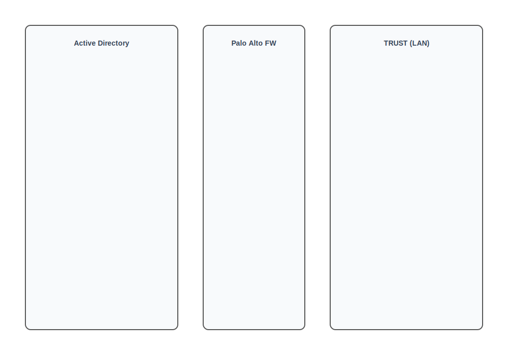

> **[Francais](#francais)** | **[English](#english)**

## Français

> **Projet solo**

# Pare-feu Palo Alto - DMZ et déchiffrement SSL avec User-ID

Deux laboratoires solo configurant un pare-feu de nouvelle génération Palo Alto Networks. Le premier laboratoire met en place une architecture DMZ avec des politiques NAT forçant un accès indirect depuis le LAN vers la DMZ via le WAN. Le second laboratoire ajoute le déchiffrement SSL (proxy sortant) et l'intégration Active Directory via User-ID pour appliquer des politiques de sécurité basées sur l'identité.

> **Cours :** 420-H54-RO - Sécurité réseau
> **Projets solos** (TP3 et TP4)

---

## Vue d'ensemble de l'architecture

---

## TP3 - DMZ avec NAT

### Disposition du réseau

| Interface | Zone | Adresse IP | Rôle |
|---|---|---|---|
| Management | - | 192.168.10.254 | Gestion Palo Alto |
| ethernet1/1 | LAN (TRUST) | 192.168.10.1/24 | Clients internes |
| ethernet1/2 | WAN (UNTRUST) | 192.168.2.33/32 | Interface internet |
| ethernet1/3 | DMZ | 192.168.20.1/24 | Zone serveur web isolée |

Le serveur web est situé dans la DMZ à 192.168.20.156.

### Règles de sécurité

La contrainte de conception principale : **les clients LAN ne doivent jamais atteindre la DMZ directement.** Tout le trafic depuis le LAN sort par l'interface WAN d'abord, puis est redirigé vers la DMZ via NAT. Trois règles appliquent cette logique :

| # | Règle | Zone source | Zone dest | Objectif |
|---|---|---|---|---|
| 1 | ALLOW-WAN-TO-DMZ | UNTRUST | DMZ | Accès externe au serveur web DMZ après DNAT |
| 2 | ALLOW-DMZ-TO-WAN | DMZ | UNTRUST | Trafic retour depuis le serveur DMZ |
| 3 | ALLOW-LAN-TO-WAN | TRUST | UNTRUST | Force le LAN via le WAN avant d'atteindre la DMZ |

Aucune règle LAN vers DMZ n'existe - c'est intentionnel. Le trafic LAN atteint l'adresse WAN, ce qui déclenche la règle DNAT pour rediriger vers la DMZ.

### Règles NAT

| Règle | Type | Description |
|---|---|---|
| TRUST-TO-UNTRUST | SNAT | Le trafic LAN sort en utilisant l'IP de l'interface WAN comme source |
| UNTRUST-TO-DMZ | DNAT | Les requêtes HTTPS vers l'IP WAN sont redirigées vers le serveur web DMZ |

---

## TP4 - Déchiffrement SSL et User-ID

### Déchiffrement SSL (proxy sortant)

- Création d'un certificat d'AC auto-signé sur le Palo Alto pour l'inspection SSL
- Import du certificat d'AC dans le magasin de racines de confiance du client Windows
- Ajout d'une règle d'inspection SSL déchiffrant le trafic TRUST vers UNTRUST avec le type `ssl-forward-proxy`
- Permet au pare-feu d'inspecter le trafic HTTPS chiffré pour les menaces et l'application des politiques

### Intégration Active Directory (User-ID)

- **Profil LDAP** pointant vers le contrôleur de domaine AD (port 389, base DN : `dc=ad,dc=local`, SSL/TLS)
- **Profil Kerberos** pour l'authentification (port 88)
- **Agent User-ID** configuré avec un compte administrateur AD, surveillant les journaux de sécurité et les sessions avec sondage des clients activé
- **Surveillance des serveurs** via WinRM-HTTP vers le contrôleur de domaine
- **Mappage de groupes** via LDAP pour importer les groupes et utilisateurs AD dans Palo Alto

### Politique de sécurité basée sur l'identité

La règle de sécurité restreint l'accès web (SSL, web-browsing, DNS, HTTPS) depuis la zone TRUST vers la zone UNTRUST **uniquement aux membres du groupe AD\marketing**. Les utilisateurs en dehors de ce groupe se voient refuser l'accès internet - appliqué au niveau du pare-feu via l'intégration User-ID.

---

## Concepts clés illustrés

- Architecture de pare-feu basée sur les zones (LAN / WAN / DMZ)
- NAT source et destination (SNAT + DNAT)
- Schéma d'accès DMZ indirect - pas de trafic direct LAN vers DMZ
- Déchiffrement SSL/TLS via proxy sortant avec AC auto-signée
- Intégration LDAP et Kerberos avec Active Directory
- Contrôle d'accès basé sur l'identité avec User-ID et mappage de groupes
- Surveillance WinRM des serveurs pour le mappage utilisateur-IP en temps réel

---

## Tech stack

Palo Alto Networks (PAN-OS), Windows Server (AD-DS, DNS, LDAP, Kerberos), certificats SSL/TLS, NAT, architecture DMZ

---

## English

> **Solo project**

# Palo Alto Firewall - DMZ & SSL Decryption with User-ID

Two solo labs configuring a Palo Alto Networks next-generation firewall. The first lab sets up a DMZ architecture with NAT policies enforcing indirect access from LAN to DMZ through the WAN. The second lab adds SSL decryption (forward proxy) and Active Directory integration via User-ID to apply identity-based security policies.

> **Course:** 420-H54-RO - Network Security
> **Solo projects** (TP3 and TP4)

---

## Architecture overview

---

## TP3 - DMZ with NAT

### Network layout

| Interface | Zone | IP Address | Purpose |
|---|---|---|---|
| Management | - | 192.168.10.254 | Palo Alto management |
| ethernet1/1 | LAN (TRUST) | 192.168.10.1/24 | Internal clients |
| ethernet1/2 | WAN (UNTRUST) | 192.168.2.33/32 | Internet-facing |
| ethernet1/3 | DMZ | 192.168.20.1/24 | Isolated web server zone |

The web server sits in the DMZ at 192.168.20.156.

### Security rules

The key design constraint: **LAN clients must never reach the DMZ directly.** All traffic from the LAN exits through the WAN interface first, then gets redirected to the DMZ via NAT. Three rules enforce this:

| # | Rule | Source Zone | Dest Zone | Purpose |
|---|---|---|---|---|
| 1 | ALLOW-WAN-TO-DMZ | UNTRUST | DMZ | External access to DMZ web server after DNAT |
| 2 | ALLOW-DMZ-TO-WAN | DMZ | UNTRUST | Return traffic from DMZ server |
| 3 | ALLOW-LAN-TO-WAN | TRUST | UNTRUST | Forces LAN through WAN before reaching DMZ |

No LAN-to-DMZ rule exists - this is intentional. LAN traffic hits the WAN address, which triggers the DNAT rule to redirect to the DMZ.

### NAT rules

| Rule | Type | Description |
|---|---|---|
| TRUST-TO-UNTRUST | SNAT | LAN traffic exits using the WAN interface IP as source |
| UNTRUST-TO-DMZ | DNAT | HTTPS requests to WAN IP are redirected to the DMZ web server |

---

## TP4 - SSL Decryption & User-ID

### SSL decryption (forward proxy)

- Created a self-signed root CA certificate on the Palo Alto for SSL inspection
- Imported the CA certificate into the Windows client's trusted root store
- Added an SSL inspection rule decrypting traffic from TRUST to UNTRUST using `ssl-forward-proxy` type
- This allows the firewall to inspect encrypted HTTPS traffic for threats and policy enforcement

### Active Directory integration (User-ID)

- **LDAP profile** pointing to the AD domain controller (port 389, base DN: `dc=ad,dc=local`, SSL/TLS)
- **Kerberos profile** for authentication (port 88)
- **User-ID agent** configured with AD administrator account, monitoring security logs and sessions with client probing enabled
- **Server monitoring** via WinRM-HTTP to the domain controller
- **Group mapping** via LDAP to pull AD groups and users into Palo Alto

### Identity-based security policy

The security rule restricts web access (SSL, web-browsing, DNS, HTTPS) from the TRUST zone to the UNTRUST zone **only for members of the AD\marketing group**. Users outside this group are denied internet access - enforced at the firewall level using the User-ID integration.

---

## Key concepts demonstrated

- Zone-based firewall architecture (LAN / WAN / DMZ)
- Source and destination NAT (SNAT + DNAT)
- Indirect DMZ access pattern - no direct LAN-to-DMZ traffic
- SSL/TLS decryption via forward proxy with self-signed CA
- LDAP and Kerberos integration with Active Directory
- Identity-based access control using User-ID and group mapping
- WinRM server monitoring for real-time user-to-IP mapping

---

## Tech stack

Palo Alto Networks (PAN-OS), Windows Server (AD-DS, DNS, LDAP, Kerberos), SSL/TLS certificates, NAT, DMZ architecture
