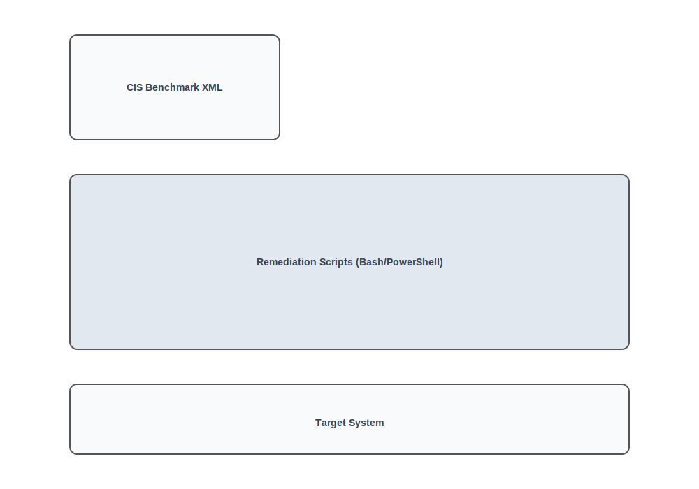

> **[Francais](#francais)** | **[English](#english)**

## Français

> **Projet solo**

# Scripts de conformité CIS Benchmark



---


Deux scripts qui auditent et corrigent les paramètres système pour la conformité CIS Benchmark - l'un pour Ubuntu 24.04 (Bash) et l'autre pour Windows 11 (PowerShell). Les deux utilisent un fichier XML comme source de vérité unique pour les valeurs attendues et supportent deux modes : validation (audit seul) et correction (remédiation automatique).

> **Cours :** Administration système / Durcissement de sécurité
> **Projet solo**

---

## Utilisation

Les deux scripts partagent la même interface d'options :

| Option | Description |
|---|---|
| `-f <file.xml>` | Fichier de configuration XML (requis) |
| `-v` | Mode validation - rapporte les éléments conformes/non conformes (défaut) |
| `-c` | Mode correction - remédiation automatique des paramètres non conformes |
| `-q` | Silencieux - affiche uniquement les résultats non conformes |
| `-s <fichier>` | Écrit la sortie dans un fichier plutôt que dans le terminal |
| `-2` | Sortie double - écrit à la fois dans le terminal et dans un fichier (nécessite `-s`) |

```bash
# Ubuntu - audit seul
bash supervision_ub24.sh -f file.xml -v

# Ubuntu - remédiation
sudo bash supervision_ub24.sh -f file.xml -c -s report.txt

# Windows - audit seul (lancer en tant qu'admin)
.\supervision_win11ed.ps1 -f file.xml -v

# Windows - remédiation
.\supervision_win11ed.ps1 -f file.xml -c -s report.txt
```

---

## Ce que chaque script vérifie et corrige

### Ubuntu 24.04 (`ubuntu24/supervision_ub24.sh`)

| Catégorie | Paramètres |
|---|---|
| Paquets inutiles | client telnet, client ftp |
| Réseau | Transfert IPv4 |
| Pare-feu | Utilitaire de pare-feu unique actif, ufw installé, ufw activé |
| Politique de mots de passe | Âge maximum, jours d'avertissement, algorithme de hachage, verrouillage des comptes inactifs, date de dernier changement dans le passé |
| Comptes utilisateurs | Comptes UID 0 (root uniquement), comptes GID 0, statut de verrouillage du compte root, shells de connexion des comptes système, délai d'expiration du shell |
| Journalisation | systemd-journald actif, système de journalisation unique actif |
| Permissions fichiers | Permissions de `/etc/passwd` |

Les corrections utilisent `apt`, `sysctl`, `systemctl`, `sed` et `chmod` selon le paramètre.

### Windows 11 (`windows11/supervision_win11ed.ps1`)

| Catégorie | Paramètres |
|---|---|
| Politique de mots de passe | Historique, âge maximum, âge minimum, longueur minimale, complexité, assouplissement des limites de longueur, chiffrement réversible |
| Verrouillage de compte | Durée, seuil, fenêtre d'observation |
| Sécurité des comptes | Statut du compte Invité, mots de passe vides limités à la console uniquement |
| Services | Service FTP Microsoft (FTPSVC) |
| Pare-feu Windows | États des profils Domaine, Privé et Public |
| Politique d'audit | Validation des identifiants, gestion des comptes utilisateurs, verrouillage de compte, événements de connexion |

Les corrections utilisent `secedit`, les écritures de registre (`Set-ItemProperty`), `auditpol` et `Set-Service`.

---

## Fichiers

| Fichier | Objectif |
|---|---|
| `ubuntu24/supervision_ub24.sh` | Script d'audit/remédiation CIS pour Ubuntu 24.04 |
| `ubuntu24/file.xml` | Configuration des valeurs attendues pour les paramètres Ubuntu |
| `windows11/supervision_win11ed.ps1` | Script d'audit/remédiation CIS pour Windows 11 (fr-FR) |
| `windows11/file.xml` | Configuration des valeurs attendues pour les paramètres Windows |

---

## Tech stack

Bash, PowerShell, xmlstarlet (Ubuntu), System.Xml.XmlDocument (Windows), secedit, auditpol, Windows Registry

---

## English

> **Solo project**

# CIS Benchmark Scripts


---


Two scripts that audit and remediate system settings for CIS Benchmark compliance - one for Ubuntu 24.04 (Bash) and one for Windows 11 (PowerShell). Both use an XML file as the single source of truth for expected values and support two modes: validation (audit only) and correction (auto-remediate).

> **Course:** System Administration / Security Hardening
> **Solo project**

---

## Usage

Both scripts share the same flag interface:

| Flag | Description |
|---|---|
| `-f <file.xml>` | XML config file (required) |
| `-v` | Validate mode - report compliant/non-compliant (default) |
| `-c` | Correct mode - auto-remediate non-compliant settings |
| `-q` | Quiet - only show non-compliant results |
| `-s <outfile>` | Write output to file instead of terminal |
| `-2` | Dual output - write to both terminal and file (requires `-s`) |

```bash
# Ubuntu - audit only
bash supervision_ub24.sh -f file.xml -v

# Ubuntu - remediate
sudo bash supervision_ub24.sh -f file.xml -c -s report.txt

# Windows - audit only (run as admin)
.\supervision_win11ed.ps1 -f file.xml -v

# Windows - remediate
.\supervision_win11ed.ps1 -f file.xml -c -s report.txt
```

---

## What each script checks and fixes

### Ubuntu 24.04 (`ubuntu24/supervision_ub24.sh`)

| Category | Parameters |
|---|---|
| Unnecessary packages | telnet client, ftp client |
| Network | IPv4 forwarding |
| Firewall | Single firewall utility in use, ufw installed, ufw enabled |
| Password policy | Max age, warning days, hashing algorithm, inactive account lock, last change date in the past |
| User accounts | UID 0 accounts (root only), GID 0 accounts, root account lock status, system account login shells, shell timeout |
| Logging | systemd-journald active, single logging system in use |
| File permissions | `/etc/passwd` permissions |

Corrections use `apt`, `sysctl`, `systemctl`, `sed`, and `chmod` depending on the parameter.

### Windows 11 (`windows11/supervision_win11ed.ps1`)

| Category | Parameters |
|---|---|
| Password policy | History, max age, min age, min length, complexity, relax length limits, reversible encryption |
| Account lockout | Duration, threshold, observation window |
| Account security | Guest account status, blank passwords to console only |
| Services | Microsoft FTP Service (FTPSVC) |
| Windows Firewall | Domain, Private, and Public profile states |
| Audit policy | Credential validation, user account management, account lockout, logon events |

Corrections use `secedit`, registry writes (`Set-ItemProperty`), `auditpol`, and `Set-Service`.

---

## Files

| File | Purpose |
|---|---|
| `ubuntu24/supervision_ub24.sh` | CIS audit/remediate script for Ubuntu 24.04 |
| `ubuntu24/file.xml` | Expected values config for Ubuntu parameters |
| `windows11/supervision_win11ed.ps1` | CIS audit/remediate script for Windows 11 (fr-FR) |
| `windows11/file.xml` | Expected values config for Windows parameters |

---

## Tech stack

Bash, PowerShell, xmlstarlet (Ubuntu), System.Xml.XmlDocument (Windows), secedit, auditpol, Windows Registry
