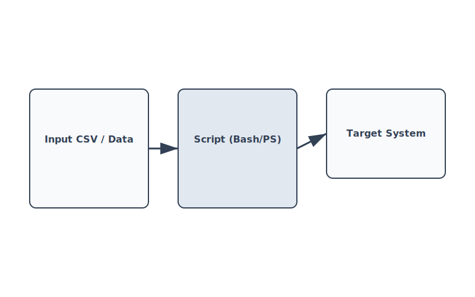

> **[Francais](#francais)** | **[English](#english)**

## Français

> **Projet solo**

# Scripts de gestion des utilisateurs

---

Collection de scripts pour créer, gérer et sauvegarder des comptes utilisateurs dans des environnements Linux et Windows. Tous les scripts de création d'utilisateurs lisent depuis un CSV ou une entrée canalisée, génèrent des noms d'utilisateur uniques (initiale du prénom + nom de famille, avec ajout de lettres de préfixe en cas de collision) et attribuent des mots de passe temporaires aléatoires.

> **Cours :** Administration système / Scripting
> **Projet solo**

---

## Scripts

| Fichier | OS | Objectif |
|---|---|---|
| `LDAP-user-creation/linux-ldap/creer_employes.bash` | Linux | Crée des utilisateurs et groupes LDAP depuis un CSV canalisé |
| `LDAP-user-creation/windows-active-directory/creer_employes.ps1` | Windows | Crée des utilisateurs dans AD ou localement selon le statut de jonction au domaine |
| `local-user-creation/linux/creer_clients.bash` | Linux | Crée des utilisateurs Linux locaux depuis une liste de noms canalisée |
| `local-user-creation/windows/creer_employes.ps1` | Windows | Crée des utilisateurs Windows locaux depuis un CSV |
| `deactivating-windows-users/desact_employe.ps1` | Windows | Désactive un compte utilisateur local par nom et numéro d'employé |
| `linux-user-backup/sauvegarde.bash` | Linux | Sauvegarde les répertoires personnels de tous les utilisateurs non système |

---

## Détails des scripts

### `LDAP-user-creation/linux-ldap/creer_employes.bash`

Lit un CSV délimité par des points-virgules depuis stdin (colonnes `system;prenom;nom;no_emp;dept;date_fin;groupe`). Traite chaque ligne : crée le groupe s'il n'existe pas (avec un GID aléatoire), génère un nom d'utilisateur unique, crée l'utilisateur LDAP avec `ldapadd`, définit un mot de passe temporaire aléatoire avec `ldappasswd` et ajoute l'utilisateur à son groupe avec `ldapmodify`. Ne traite que les lignes où `system` est `AD` ou `Local-AD` - ignore `Local`. Les mots de passe temporaires sont générés à partir d'une liste de mots + symbole + 3 derniers chiffres du numéro d'employé.

### `LDAP-user-creation/windows-active-directory/creer_employes.ps1`

Même format CSV que le script Linux LDAP. Détecte au démarrage si la machine est jointe au domaine (`Win32_ComputerSystem.PartOfDomain`). Si jointe au domaine, crée des utilisateurs AD avec `New-ADUser` (UPN, email, département, expiration). Sinon, bascule sur la création d'utilisateurs locaux. Dans les deux cas, utilise la même logique de génération de nom d'utilisateur et de mot de passe.

### `local-user-creation/linux/creer_clients.bash`

Lit des paires prénom/nom depuis stdin (une par ligne, séparées par un espace ou une tabulation). Génère un nom d'utilisateur unique, crée l'utilisateur avec `useradd -m` et définit le mot de passe via `chpasswd`. Termine avec un code de statut spécifique pour chaque type d'échec (erreur de création = 3, erreur de mot de passe = 4).

### `local-user-creation/windows/creer_employes.ps1`

Lit le même format CSV délimité par des points-virgules. Crée des utilisateurs locaux avec `New-LocalUser`, crée des groupes avec `New-LocalGroup` si nécessaire, ajoute les utilisateurs à leur groupe. Force le changement de mot de passe à la première connexion via `net user /logonpasswordchg:yes`. Gère la date d'expiration de contrat optionnelle.

### `deactivating-windows-users/desact_employe.ps1`

Prend trois paramètres obligatoires : `-PrenomEmploye`, `-NomEmploye`, `-NoEmploye`. Recherche les utilisateurs locaux dont la description contient le numéro d'employé et dont le nom complet correspond. Appelle `Disable-LocalUser` sur la correspondance, ou affiche une erreur si non trouvé.

### `linux-user-backup/sauvegarde.bash`

Itère toutes les entrées dans `/etc/passwd`. Ignore les utilisateurs avec un UID inférieur à 1000 (comptes système). Pour chaque utilisateur régulier avec un répertoire personnel, crée une archive `tar.gz` horodatée dans `/tmp/sauvegarde/`. Enregistre chaque action (démarrage, succès, ignorée, échec) dans un fichier `.log` avec le même horodatage.

---

## Tech stack

Bash, PowerShell, outils CLI OpenLDAP (`ldapadd`, `ldappasswd`, `ldapmodify`, `ldapsearch`), Active Directory (`New-ADUser`), cmdlets de comptes locaux Windows

---

## English

> **Solo project**

# User Management Scripts

---

Collection of scripts for creating, managing, and backing up user accounts across Linux and Windows environments. All user creation scripts read from a CSV or piped input, generate unique usernames (first initial + last name, adding prefix letters on collision), and assign randomized temporary passwords.

> **Course:** System Administration / Scripting
> **Solo project**

---

## Scripts

| File | OS | Purpose |
|---|---|---|
| `LDAP-user-creation/linux-ldap/creer_employes.bash` | Linux | Creates LDAP users and groups from piped CSV |
| `LDAP-user-creation/windows-active-directory/creer_employes.ps1` | Windows | Creates users in AD or locally depending on domain join status |
| `local-user-creation/linux/creer_clients.bash` | Linux | Creates local Linux users from piped name list |
| `local-user-creation/windows/creer_employes.ps1` | Windows | Creates local Windows users from CSV |
| `deactivating-windows-users/desact_employe.ps1` | Windows | Disables a local user account by name and employee number |
| `linux-user-backup/sauvegarde.bash` | Linux | Backs up home directories for all non-system users |

---

## Script details

### `LDAP-user-creation/linux-ldap/creer_employes.bash`

Reads a semicolon-delimited CSV from stdin (`system;prenom;nom;no_emp;dept;date_fin;groupe` columns). Processes each row: creates the group if it doesn't exist (with a random GID), generates a unique username, creates the LDAP user with `ldapadd`, sets a random temp password with `ldappasswd`, and adds the user to their group with `ldapmodify`. Only processes rows where `system` is `AD` or `Local-AD` - skips `Local`. Temp passwords are generated from a word list + symbol + last 3 digits of employee number.

### `LDAP-user-creation/windows-active-directory/creer_employes.ps1`

Same CSV format as the Linux LDAP script. Detects at startup whether the machine is domain-joined (`Win32_ComputerSystem.PartOfDomain`). If domain-joined, creates AD users with `New-ADUser` (UPN, email, department, expiry). If not domain-joined, falls back to local user creation. In both cases, uses the same username generation and password logic.

### `local-user-creation/linux/creer_clients.bash`

Reads first/last name pairs from stdin (one per line, space or tab separated). Generates a unique username, creates the user with `useradd -m`, and sets the password via `chpasswd`. Exits with a specific status code on each failure type (creation error = 3, password error = 4).

### `local-user-creation/windows/creer_employes.ps1`

Reads the same semicolon-delimited CSV format. Creates local users with `New-LocalUser`, creates groups with `New-LocalGroup` if needed, adds users to their group. Forces password change on first login via `net user /logonpasswordchg:yes`. Handles optional contract expiry date.

### `deactivating-windows-users/desact_employe.ps1`

Takes three mandatory parameters: `-PrenomEmploye`, `-NomEmploye`, `-NoEmploye`. Searches local users where the description contains the employee number and the full name matches. Calls `Disable-LocalUser` on the match, or prints an error if not found.

### `linux-user-backup/sauvegarde.bash`

Iterates all entries in `/etc/passwd`. Skips users with UID below 1000 (system accounts). For each regular user with a home directory, creates a timestamped `tar.gz` archive in `/tmp/sauvegarde/`. Logs every action (start, success, skip, failure) to a `.log` file with the same timestamp.

---

## Tech stack

Bash, PowerShell, OpenLDAP CLI tools (`ldapadd`, `ldappasswd`, `ldapmodify`, `ldapsearch`), Active Directory (`New-ADUser`), Windows local account cmdlets
